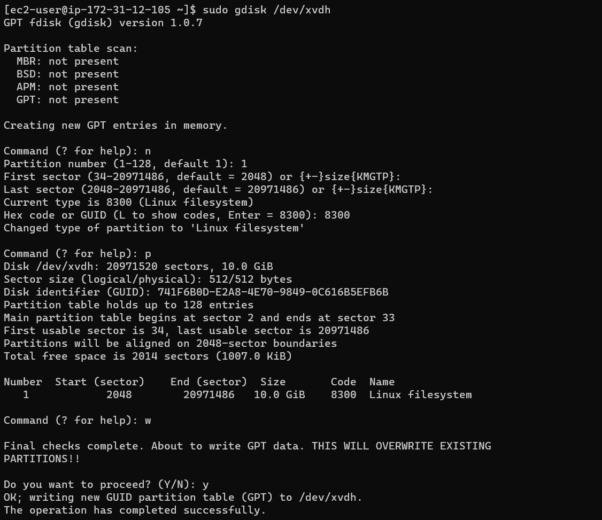
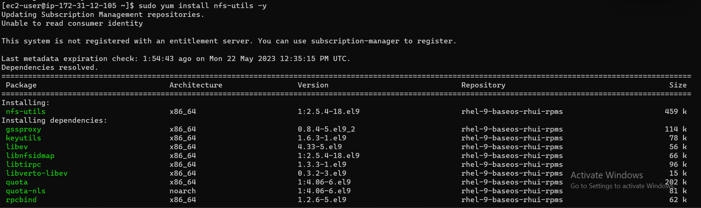
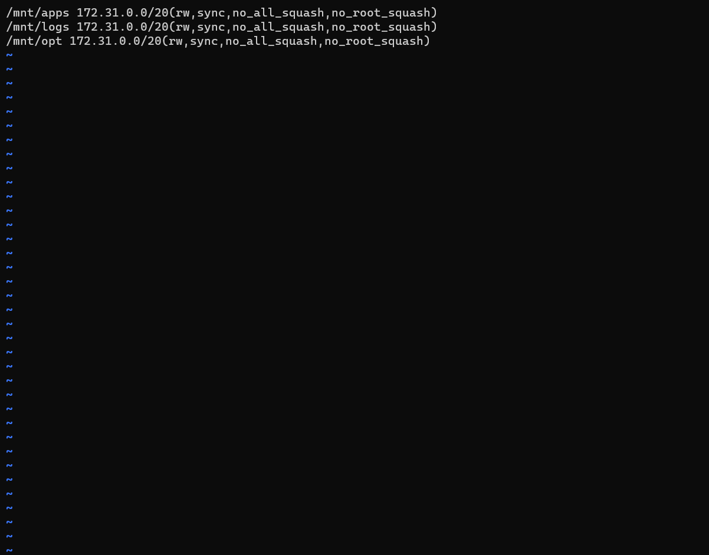
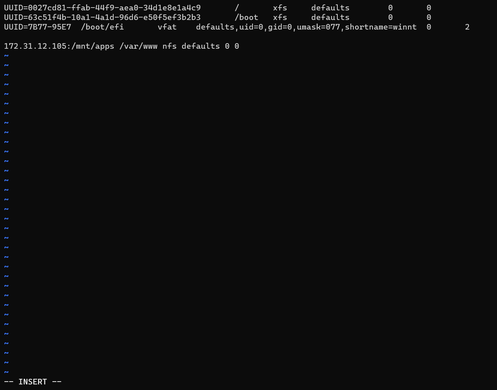

# CREATING A DEVOPS TOOLING WEBSITE SOLUTION

### PREPARING NFS SERVER

opening up three EC2 instances with RHEL Linux 9 Operating System

`lsblk` checking blocks where disks are (nfs server)

`sudo gdisk /dev/xvdf`	using gdisk to partition first disk (nfs server)

`sudo gdisk /dev/xvdg` using gdisk to partition second disk (nfs server)

`sudo gdisk /dev/xvdh`	using gdisk to partition third disk (nfs server)

`lsblk` (nfs server)

` sudo yum install lvm2 -y` installing lvm2

`sudo lvmdiskscan` (nfs server)

`lsblk` (nfs server)

`sudo pvcreate /dev/xvdf1 /dev/xvdg1 /dev/xvdh1` creating physical volumes (nfs server)

`sudo pvs` checking physical volumes created (nfs server)

`sudo vgcreate webdata-vg  /dev/xvdf1 /dev/xvdg1 /dev/xvdh1` creating a group for my physical volumes so it can be seen as one (cocantinate) (nfs server)

`sudo vgs`  confirming volume group created (nfs server)

`sudo lvcreate -n apps-lv -L 9G webdata-vg` creating logical volume for apps-lv (nfs server)

`sudo lvcreate -n logs-lv -L 9G webdata-vg` creating logical volume for logs-lv (nfs server)

`sudo lvcreate -n opt-lv -L 9G webdata-vg` creating logical volume for opt-lv (nfs server)

`sudo lvs` (nfs server)

`lsblk` checking logical volumes in block (nfs server)

`sudo vgdisplay -v #view complete setup - VG, PV, and LV` (nfs server)

`sudo mkdir /mnt/apps` (nfs server)

`sudo mkdir /mnt/logs` (nfs server)

`sudo mkdir /mnt/opt`  (nfs server)

`sudo mount /dev/webdata-vg/apps-lv /mnt/apps` (nfs server)

`sudo mount /dev/webdata-vg/logs-lv /mnt/logs` (nfs server)

`sudo mount /dev/webdata-vg/opt-lv /mnt/opt` (nfs server)

`sudo yum -y update` (nfs server)

`sudo yum install nfs-utils -y` (nfs server)

`sudo systemctl start nfs-server.service` (nfs server)

`sudo systemctl enable nfs-server.service` (nfs server)

`sudo systemctl status nfs-server.service` (nfs server)

`sudo chown -R nobody: /mnt/apps` (nfs server)

`sudo chown -R nobody: /mnt/logs` (nfs server)

`sudo chown -R nobody: /mnt/opt` (nfs server)

`sudo chmod -R 777 /mnt/apps` (nfs server)

`sudo chmod -R 777 /mnt/logs` (nfs server)

`sudo chmod -R 777 /mnt/opt` (nfs server)

`sudo systemctl restart nfs-server.service` (nfs server)

`sudo vi /etc/exports` (nfs server)

`sudo exportfs -arv` (nfs server)

`rpcinfo -p | grep nfs` to check which port is used by nfs so it can be opened (nfs server)

opening ports in EC2 instance

`vi /etc/yum/pluginconf.d/product-id.conf` setting enabled=0 (db server)

`/etc/yum/pluginconf.d/subscription-manager.conf` setting enabled=0 (db server)

`sudo yum update` (db server)

`sudo yum install mysql-server -y` (db server)

`sudo systemctl start mysqld` (db server)

`sudo systemctl enable mysqld` (db server)

`sudo systemctl status mysqld` (db server)

`sudo mysql` (db server)

`mysql> create database tooling;` (db server)

`mysql> create user 'webaccess'@'172.31.0.0/20' identified by 'password';` (db server)

`mysql> grant all privileges on tooling.* to 'webaccess'@'172.31.0.0/20';` (db server)

`mysql> flush privileges;` (db server)

`mysql> show databases;` (db server)

`mysql> use tooling;` (db server)

`mysql> exit` (db server)

`sudo yum install nfs-utils nfs4-acl-tools -y` (nfs server)

`sudo mkdir /var/www` (nfs server)

`sudo mount -t nfs -o rw,nosuid <NFS-Server-Private-IP-Address>:/mnt/apps /var/www` (nfs server)

`sudo vi /etc/fstab` (nfs server)

`sudo yum install httpd -y` (webserver 1)

`sudo dnf install https://dl.fedoraproject.org/pub/epel/epel-release-latest-8.noarch.rpm`  (webserver 1)

`sudo dnf install dnf-utils http://rpms.remirepo.net/enterprise/remi-release-8.rpm`    (webserver 1)

`sudo dnf module reset php`(webserver 1)

`sudo dnf module enable php:remi-7.4`  (webserver 1)

`sudo dnf install php php-opcache php-gd php-curl php-mysqlnd`(webserver 1)

`sudo systemctl start php-fpm`  (webserver 1)

`sudo systemctl enable php-fpm` (webserver 1)

`setsebool -P httpd_execmem 1` (webserver 1)

repeat steps (installation) above for webserver 2, 3, 4

`sudo touch /var/www/test.md` (webserver 1)

`ls /mnt/apps` (nfs server)

`sudo mount -t nfs -o rw,nosuid 172.31.12.105:/mnt/logs /var/log/httpd` (webservers 1,2,3)

`sudo vi /etc/fstab` (webservers 1,2,3)

`172.31.12.105:/mnt/apps /var/www nfs defaults 0 0` (webservers 1,2,3)

`sudo yum install git -y`   (webservers 1,2,3)

`git init` initializing an empty git repository for webservers 1,2,3

`git clone https://github.com/darey-io/tooling.git` (webservers 1,2,3)

`ls` webserver 1

`cd tooling/` (webservers 1,2,3)

`ls` checking files in tooling directory  (webservers 1,2,3)

`ls /var/www`  (webservers 1,2,3)

`sudo cp -R html/. /var/www/html` copying contents html in the tooling directory to /var/www  (webservers 1,2,3)

`ls /var/www/html`  (webservers 1,2,3)

`ls html`  (webservers 1,2,3)

open port 80 on my EC2 instance to connect from any where

`sudo systemctl status httpd` checking status of apache server

`cd ..`  (webservers 1,2,3)

`sudo setenforce 0`  (webservers 1,2,3)

`sudo vi /etc/sysconfig/selinux`  (webservers 1,2,3)

`sudo systemctl start httpd`  (webservers 1,2,3)

`sudo systemctl status httpd`  (webservers 1,2,3)

`sudo vi /var/www/html/functions.php`

`sudo vi /etc/my.cnf` (database server)

`cd tooling` (webservers 1,2,3)

`sudo yum mysql -y`  (webservers 1,2,3)

`mysql -h 172.31.12.13 -u webaccess -p tooling < tooling-db.sql`  (webservers 1,2,3)

`sudo mysql`

`sudo vi tooling-db.sql` in tooling directory (webservers 1,2,3)

`sudo mysql`   (db server)

`create user 'myuser'@'%' identified by 'password';` (db server)

` grant all privileges on tooling.* to 'myuser'@'%';` (db server)

`show databases;` (db server)

`use users;` (db server)

` create table users(` (db server)

`ID VARCHAR(60) NOT NULL,` (db server)

` USERNAME VARCHAR(60) NOT NULL,` (db server)

` PASSWORD VARCHAR(60) NOT NULL,` (db server)

`EMAIL VARCHAR(60) NOT NULL,` (db server)

`USER_TYPE VARCHAR(60) NOT NULL,` (db server)

`STATUS VARCHAR(60) NOT NULL,` (db server)

`PRIMARY KEY(ID));` (db server)

` INSERT INTO users VALUE ("1", "myuser", "5f4dcc3b5aa765d61d8327deb882cf99", "user@mail.com", "admin", "1");` (db server)

[logging in website with my user](http://18.116.27.32/index.php)

